# 
Universidad Nacional del Comahue

# 
Facultad de Informatica

# 
Programacion Web Avanzada

# 
PWA-REACT
  
  

  
  

  
  
  
## Integrantes: 
* Fuentes Camila FAI-4241  
* Fuentealba Dario FAI-4424  
* Riveiro Matías FAI-4438  
  
  
  
# 
Trabajo Práctico N° 2
  
  
## 
 RealTech 
  

Esta aplicación es una PWA desarrollada con React que permite visualizar y explorar distintos componentes de computadora, organizados por categorías.

## 
 Funcionalidades principales 

Página de inicio (Home):
Muestra las categorias disponibles (por ejemplo: Procesadores, Placas de video, Memorias, etc.). Al hacer click en una, redirige a la vista de esa categoria.

Vista de categoría:
Se presentan tarjetas con componentes pertenecientes a esa categoria, en forma de lista horizontal o vertical. Cada tarjeta contiene: imagen del componente,
estrella de favorito (azul si está guardado en localStorage), nombre del componente y el boton de ver detalle que redirecciona a la pagina de informacion. 

Página de información de componente:
Al hacer clic en una tarjeta, se accede a una vista detallada que muestra: título, marca, mModelo, especificaciones tecnicas (extraidas de una segunda API), 
descripción (en español o inglés, segun idioma detectado). 

Favoritos:
Se accede desde la barra de navegación. Muestra las tarjetas guardadas como favoritas (usando localStorage), con las mismas funcionalidades de visualizacion.

Barra de navegación:
Incluye accesos rapidos a: inicio, categorías (con dropdown) y favoritos

Buscador:
En las vistas de categoria y favoritos se puede buscar por nombre o categoria.

## 
API

Hicimos uso de MockApi para realizar nuestra propia api de componentes. 
MockAPI principal:
Contiene información de los componentes:
id, nombre, image, category, descripcion (con versiones en es y en) y precio.

API secundaria:
Provee detalles técnicos:
id, idComponente, marca, modelo, fecha de lanzamiento y especificaciones.

# 
Idioma

La app está completamente traducida al español e inglés, gracias a la integración con i18n.
El contenido se adapta dinámicamente al idioma seleccionado o detectado.

# 
Responsive

La interfaz se adapta tanto a pantallas de escritorio como a dispositivos móviles, garantizando una buena experiencia en cualquier dispositivo.

# Ejercicio 1) c)
1. Clonamos el repositorio:
git clone https://github.com/CamilaFuentess/PWA-REACT  
2. Ingresamos al directorio del proyecto: 
cd C:\REACT\PWA-REACT\TP-REACT-1  
3. Instalamos las dependencias: 
npm install  
4. Se ejecuta el comando (inicia la aplicacion): 
npm run dev  
  
  

## 
Instalación Node.js y npm
  
  
1. Luego de instalar node.js y npm, verifico sus versiones para ver que estén instalados.  
  
  
2. Ahora hago que me genere la estructura de carpetas, le pongo un nombre al proyecto, un nombre al archivo Package.json, elijo que quiero trabajar con React y con JavaScript + SWC
  
  
  
3. Si sale este error es porque no estoy en la carpeta correcta.  
Acá debo hacer cd TP-REACT-1 para colocarme en la carpeta correcta.  
  
  
  
4. Uso npm install para instalar todas las dependencias del proyecto, es decir, las librerías y paquetes que la aplicación necesita para funcionar.
  
  
5. Se ejecuta el comando npm run dev para iniciar la aplicacion.   
  
  
  
## 
Instalación de react-i18next
  
  
1. Voy a la página https://www.i18next.com/overview/getting-started  
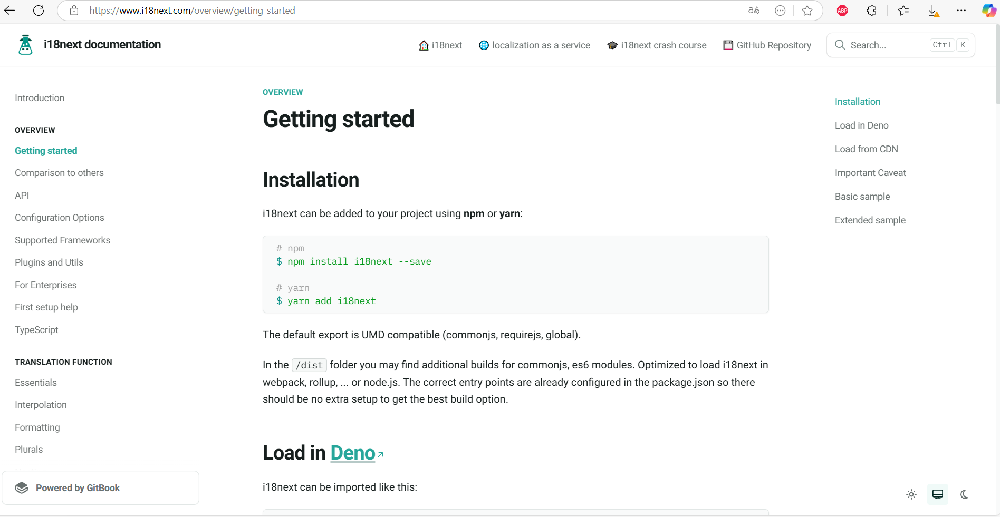  
  
2. Copio esto en la consola de VSC. 
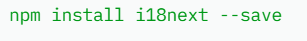  
Sucede ésto:  
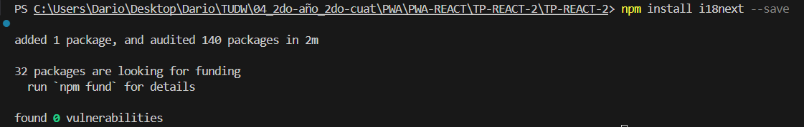  
  
3. Ingreso el siguiente comando: npm install i18next react-i18next  
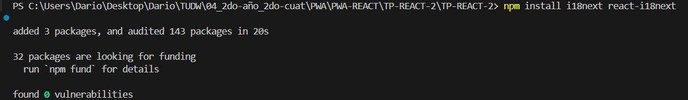  
  
4. Dentro de la carpeta src, creo el script i18n.js  
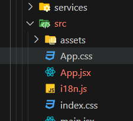  
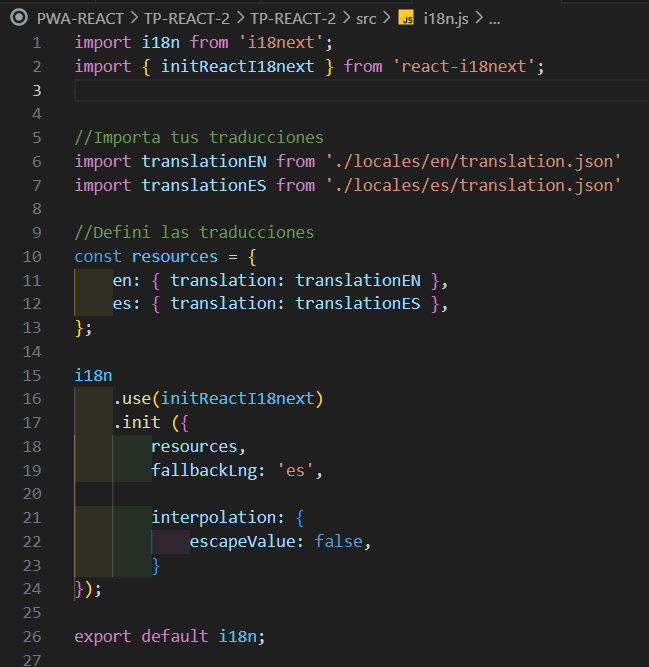  
  
5. Lo importo en main.jsx  
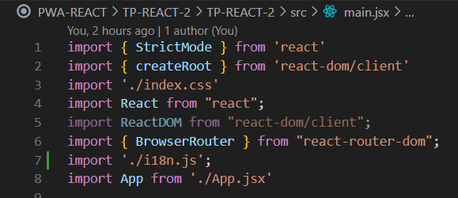  
  
6. Creo los archivos de translation.  
  src/locales/en/translation.json  
  src/locales/es/translation.json  
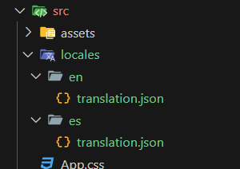  
  
7. Agrego contenido a dichos scripts:  
es/translation.json  
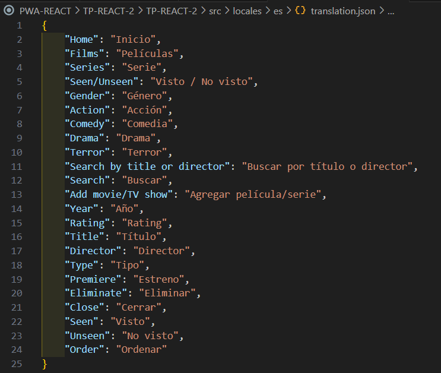  
en/translation.json  
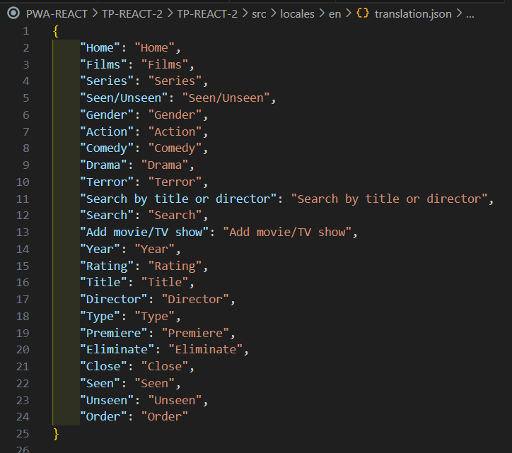  

1. Instalación de react-i18next.  
  
  
2. Si quiero que las traducciones se cargen desde archivos .json (lo más común)
 
  
3. Este i18next-http-backend permite que i18next busque las traducciones desde archivos en nuestro servidor.
  
  
  
## 
Instalar Tailwind CSS y configurarlo dentro del proyecto
  
  
1. Ingresar a https://tailwindcss.com/docs/installation/using-vite.  
  
  
2. Iniciar la instalación de Tailwind.
  
  
  
3. Agrego ésto al script vite.config.ts.   
  
Antes el script vite.config.ts era así:  
  
Ahora quedará así:  
  
  
4. Debo importar el Tailwind a mi script App.css  
  
Antes estaba así:  
  
Ahora se verá así:  
  
  
5. Uso Tailwind en mi index.html  
  
  
  
6. Comenzamos  
  
  
7. Verifico que funciona correctamente  
  
  
    
  ## 
Instalar react router DOM
  
  
1. En la terminal ejecuto npm i react-router-dom.  
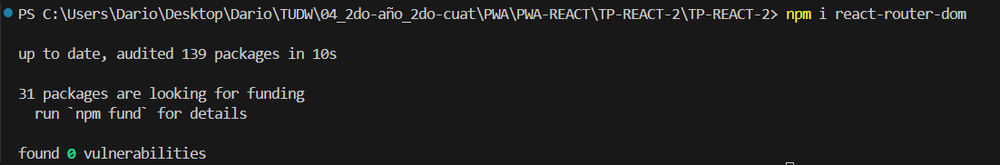  
  
2. Debo hacer ésto en el main.jsx.
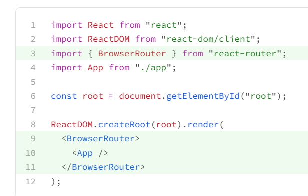  
  
3. Ésto tengo originalmente en mi main.jsx.   
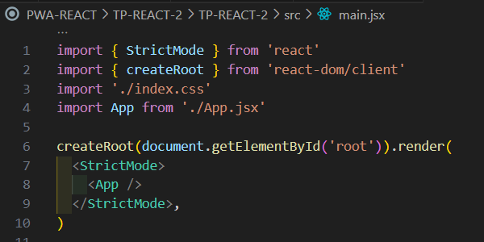  
  
4. Lo dejo así:  
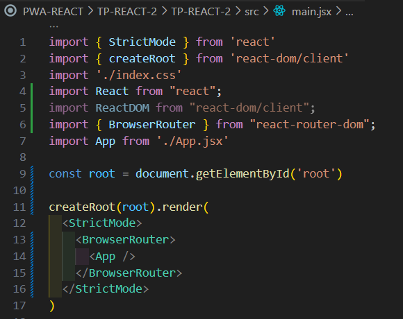  
  
