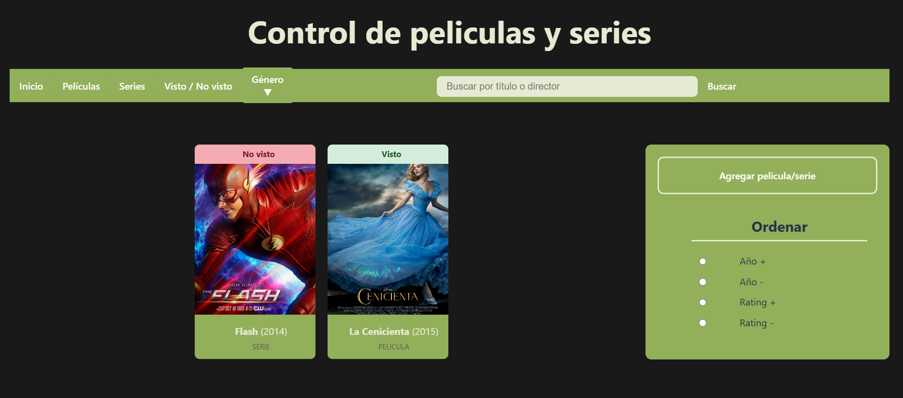
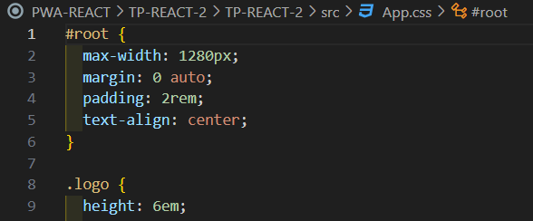

# 
Universidad Nacional del Comahue

# 
Facultad de Informatica

# 
Programacion Web Avanzada

# 
PWA-REACT
  
  

  
  

  
  
  
## Integrantes: 
* Fuentes Camila FAI-4241  
* Fuentealba Dario FAI-4424  
* Riveiro Matías FAI-4438  
  
  
  
# 
Trabajo Práctico N° 1
  
  
  
# 
Aplicacion: Gestion de peliculas y series.
 
La aplicacion permite gestionar un catalogo de peliculas y series de manera sencilla e intuitiva.
Cuenta con una barra de navegacion que incluye los siguientes filtros:
inicio, peliculas, series, vista / No vista. 

Al hacer click sobre la imagen de una  pelicula o serie, se abre un cuadro informativo con todos sus detalles: titulo, director, año, rating, genero e url de una imagen. Dentro de este cuadro se encuentran tres botones:
* Eliminar: elimina la pelicula o serie del catalogo.
* Vista/no vista: cambia el estado de visualizacion.
* Cerrar: cierra la carta del contenido 

Tambien esta la opcion de hacer click sobre el titulo del contenido y se abre un formulario para modificar los datos de la pelicula/serie. 

Y la opcion agregar esta al costado. 

  # 
Ejercicios del práctico.  
  
    
# Ejercicio 7) c)
1. Clonamos el repositorio:
git clone https://github.com/CamilaFuentess/PWA-REACT  
2. Ingresamos al directorio del proyecto: 
cd C:\REACT\PWA-REACT\TP-REACT-1  
3. Instalamos las dependencias: 
npm install  
4. Se ejecuta el comando (inicia la aplicacion): 
npm run dev  
  
  
# Ejercicio 2) a) i)  
Explicar la función de los siguientes archivos iniciales: index.js, App.js, index.css y package-json.js.  

  ## index.js o main.jsx
  
  index.js (o a veces main.jsx en proyectos con React + Vite) es el punto de entrada principal de la aplicación React. Es como el corazón que arranca todo.  
  Sin index.js, React no sabría por dónde empezar.  

  ### ¿Qué hace normalmente index.js?  

  1. Importa React y ReactDOM (la librería que renderiza React en el navegador)  

  2. Importa el componente principal (por ejemplo, App.jsx)  

  3. Conecta la app al HTML, insertándola en un div con id "root" (que está en el index.html)  

  4. A veces también aplica estilos globales o configura otras cosas como contextos o providers.  
  
### ¿Y cómo se conecta con el index.html?  
En el index.html está este div:  

  
Y en el index.js, esta línea:
document.getElementById('root')
  
  
## App.js  

App.js es uno de los archivos más importantes en una app React. Es como el centro de control de la aplicación: el componente principal desde el cual se estructura todo lo demás.  
Es un componente de React (normalmente una función) que representa la interfaz base de la aplicación. Todo lo que se ve en pantalla parte desde ahí.  
Es como el "escenario principal" donde se armo y muestro todo lo que compone mi app.  

  ### ¿Para qué sirve?  

  1. Organiza y muestra otros componentes: Dentro de App.js puede tener componentes como <Navbar />, <Footer />, <Home />, etc.  

  2. Lógica de estado principal (opcional): Puedo manejar estados globales o lógicos que afecten varias partes de la app.  

  3. Establece el diseño base: Suele contener el layout principal o los estilos generales.  

  ### Por ejemplo  
  
// App.js  
import React from 'react'  
  
function App(){  
  return (  
    &lt;div&gt;  
      &lt;h1&gt;Bienvenido a mi app React&lt;/h1&gt;  
      &lt;p&gt;¡Hola mundo!&lt;/p&gt;  
    &lt;/div&gt; 
  )  
}  
  
export default App 
  
    
  Este componente se muestra cuando React lo renderiza desde index.js:  
    
      
  import App from './App'  

  ## index.css  
  
  El archivo index.css en un proyecto React sirve para definir estilos globales que se aplican a toda la aplicación. Es como una hoja de estilo general que se carga al inicio del proyecto.  
  Sirva para definir como se ven los elementos básicos y dejar la aplicación con una base visual coherente.  
  Son los estilos globales que afectan a toda la app.  
  
### ¿Qué hace?  
  
  1. Aplica estilos base para todos los elementos HTML (body, h1, p, etc.)  
  
  2. Puede reiniciar estilos por defecto del navegador (como márgenes o paddings)  
  
  3. Establece fuentes, colores, espaciado o cualquier configuración visual general.  
  
  4. Lo uso para personalizar la apariencia global de mi aplicación React.  
  
  ### ¿Dónde se usa?  
  
Está importado normalmente en el archivo index.js (o main.jsx) así:  
import './index.css'  
Con esa línea, el navegador carga los estilos definidos ahí y los aplica a toda la app.  
  
  
  ## package.json  
  
  Es el archivo central de configuración de cualquier proyecto hecho con Node.js o herramientas basadas en Node, como React, Vite, Next, etc.  
  Es el "cerebro administrativo" del proyecto.  
  Me dice qué librerías tiene, como se corre, como se construye, y como se llama la app.  
  
  ### ¿Para qué sirve?  
  
  1. Define el nombre, versión y descripción del proyecto.  
  
  2. Lista todas las dependencias (librerías instaladas)  
  
  3. Define scripts que Puedo ejecutar con npm run o yarn.  
  
  4. Contiene configuraciones para herramientas como Babel, ESLint, Vite, etc.  
  
  
  
# 
Trabajo Práctico N° 2
  
  
  
## 
Instalación Node.js y npm
  
  
1. Luego de instalar node.js y npm, verifico sus versiones para ver que estén instalados.  
  
  
2. Ahora hago que me genere la estructura de carpetas, le pongo un nombre al proyecto, un nombre al archivo Package.json, elijo que quiero trabajar con React y con JavaScript + SWC
  
  
  
3. Si sale este error es porque no estoy en la carpeta correcta.  
Acá debo hacer cd TP-REACT-1 para colocarme en la carpeta correcta.  
  
  
  
4. Uso npm install para instalar todas las dependencias del proyecto, es decir, las librerías y paquetes que la aplicación necesita para funcionar.
  
  
5. Se ejecuta el comando npm run dev para iniciar la aplicacion.   
  
  
  
## 
Instalación de react-i18next
  
  
1. Instalación de react-i18next.  
  
  
2. Si quiero que las traducciones se cargen desde archivos .json (lo más común)
 
  
3. Este i18next-http-backend permite que i18next busque las traducciones desde archivos en nuestro servidor.
  
  
  
## 
Instalar Tailwind CSS y configurarlo dentro del proyecto
  
  
1. SIngresar a https://tailwindcss.com/docs/installation/using-vite.  
  
  
2. Iniciar la instalación de Tailwind.
  
  
  
3. Agrego ésto al script vite.config.ts.   
  
Antes el script vite.config.ts era así:  
  
Ahora quedará así:
  
  
4. Debo importar el Tailwind a mi script App.css  
  
Antes estaba así:  
  
Ahora se verá así:  
  
  
5. Uso Tailwind en mi index.html  
  
  
  
6. Comenzamos  
  
  
7. Verifico que funciona correctamente  
  
